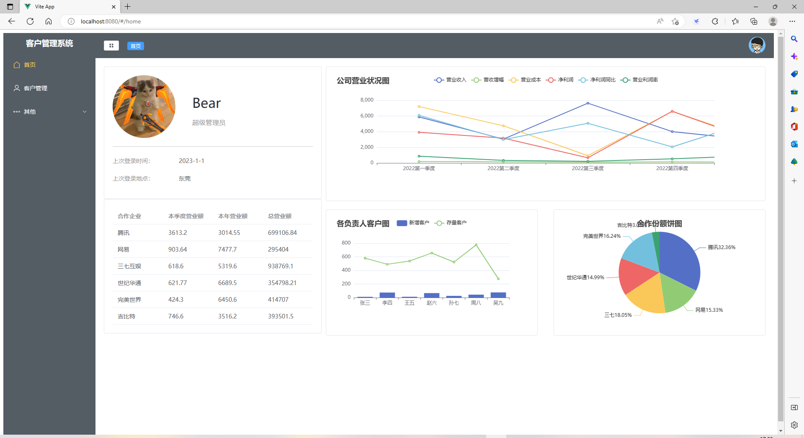
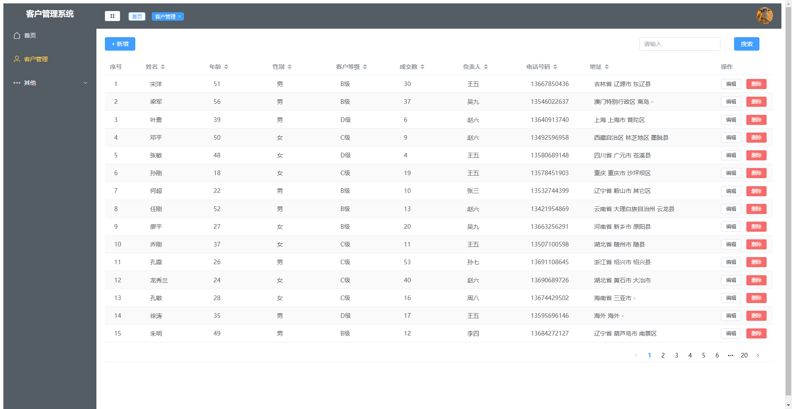
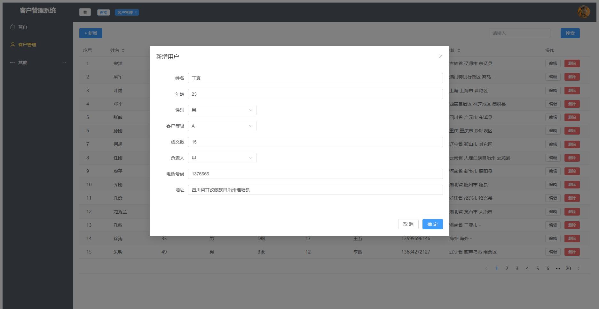
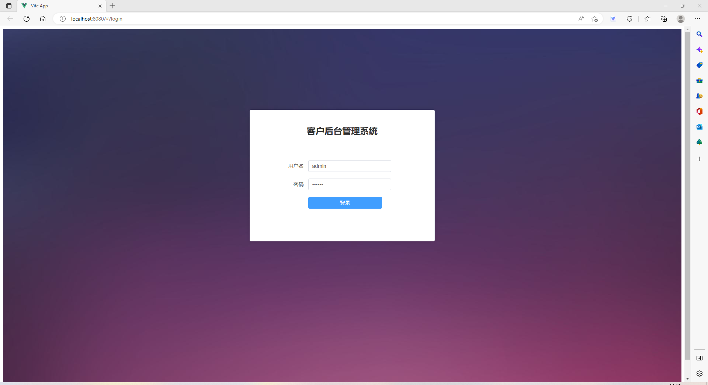

# 使用须知

## Customize configuration

See [Vite Configuration Reference](https://vitejs.dev/config/).

## Project Setup

```sh
npm install
```

### Compile and Hot-Reload for Development

```sh
npm run dev
```

### Compile and Minify for Production

```sh
npm run build
```

# Customer-Management-System
客户管理系统
# 一、导读
## 系统简介
本系统是一个简易的后台客户系统，实现了<br />
(1) 系统登录和退出<br />
(2) 客户管理，包含：增、删、改、查功能<br />
(3) 客户统计：用echart或highchart展示新增和存量客户数，根据负责人统计客户数<br />
# 二、系统详情
## 功能需求实现
本系统主要使用Vue2进行编写，使用Pinia进行状态管理，使用vue-router进行路由管理，页面搭建主要采用了element-ui组件库。<br />
由于本项目的练习时间较早，当时还未完整学习后端，故没有设计与后端的数据请求交互等。网页所需要的数据使用Mock进行随机模拟生成，登录功能的账号密码也直接固定，即：<br />
## 用户名： admin
## 密码： 123456
关于前后端分离系统的http请求、数据交互、数据库操作等知识可移步隔壁仓库《仿知乎日报系统》
### 技术选型：
本系统使用的技术栈如下：<br />
(1)前端框架：Vue2<br />
(2)组件库：Element-Plus<br />
(3)状态管理库：Pinia<br />
(4)数据模拟：Mock<br />
# 三、设计结果
### 首页：

### 客户管理页：


### 登录页：



